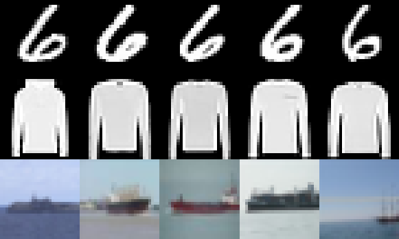
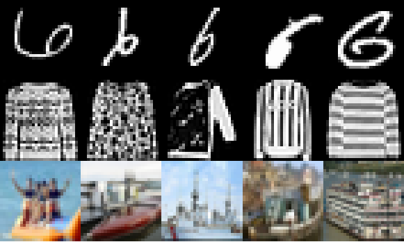

# Deep One-Class Classification Using Intra-Class Splitting

This repository contains an implementation of a one-class classification method using deep learning. The method was proposed in our "Deep One-Class Classification Using Intra-Class Splitting" paper presented at the IEEE Data Science Workshop 2019. It is based on intra-class splitting, i.e. splitting given normal samples into typical and atypical subsets:

<p align="center">



</p>

## Paper
[Deep One-Class Classification Using Intra-Class Splitting](https://arxiv.org/abs/1902.01194)  
by Patrick Schlachter, Yiwen Liao and Bin Yang  
Institute of Signal Processing and System Theory, University of Stuttgart, Germany  
IEEE Data Science Workshop 2019 in Minneapolis, Minnesota

If you use this work for your research, please cite our paper:
```
@inproceedings{schlachter2019,
	author={Patrick Schlachter, Yiwen Liao and Bin Yang},
	booktitle={2019 IEEE Data Science Workshop (DSW)},
	title={Deep One-Class Classification Using Intra-Class Splitting},
	year={2019},
	month={June},
}
```

## Repository
### `models`
Contains build and train functions of the underlying neural network models.

### `toolkits`
Contains evaluation, visualization and util functions.

### `main.py`
The main function to start training and evaluation.

### `packages.py`
Imports necessary Python packages.
